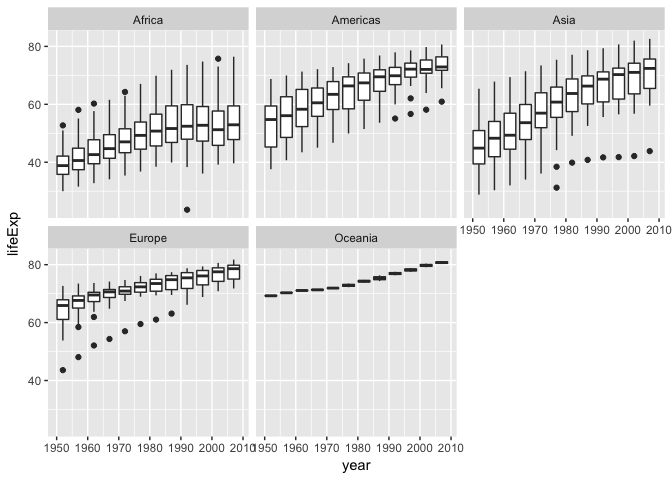
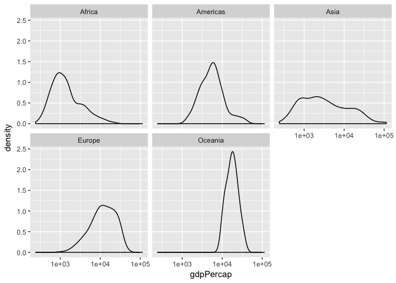
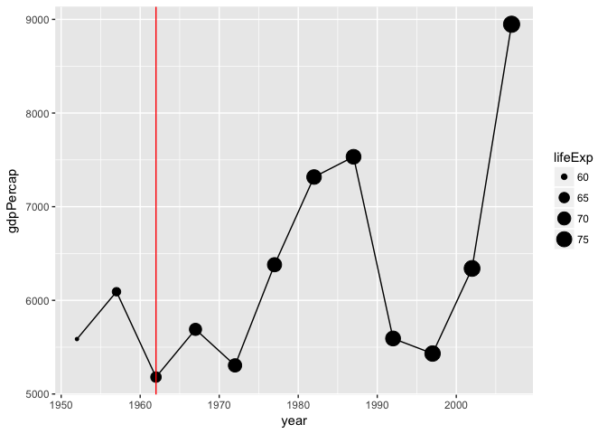

HW03: Exploring `gapminder` using `ggplot2` and `dplyr`
================
Emre Erhan
2018-10-01

## Get libraries

``` r
suppressPackageStartupMessages(library(dplyr))
suppressPackageStartupMessages(library(gapminder))
suppressPackageStartupMessages(library(ggplot2))
```

## Task 1: How is life expectancy changing over time on different continents? And which continent has historically had greater life expectancy?

``` r
gapminder %>%
  select(continent, year, lifeExp) %>%
  arrange(continent, year) %>%
  ggplot(aes(year, lifeExp)) +
  geom_boxplot(aes(group = year)) +
  facet_wrap(~ continent)
```

<!-- -->

``` r
gapminder %>%
  select(continent, year, lifeExp) %>%
  group_by(continent) %>%
  summarise('mean(lifeExp)' = mean(lifeExp), 'sd(lifeExp)' = sd(lifeExp)) %>%
  knitr::kable()
```

| continent | mean(lifeExp) | sd(lifeExp) |
| :-------- | ------------: | ----------: |
| Africa    |      48.86533 |    9.150210 |
| Americas  |      64.65874 |    9.345088 |
| Asia      |      60.06490 |   11.864532 |
| Europe    |      71.90369 |    5.433178 |
| Oceania   |      74.32621 |    3.795611 |

The data suggests that Oceania has had the greatest life expectency.

## Task 2: What is the spread of GDP per capita within the continents?

``` r
gapminder %>%
  ggplot(aes(gdpPercap)) +
  scale_x_log10() +
  geom_density() +
  facet_wrap(~ continent)
```

<!-- -->

``` r
gapminder %>%
  select(continent, gdpPercap) %>%
  group_by(continent) %>%
  summarise('min(gdpPercap)' = min(gdpPercap),
            'max(gdpPercap)' = max(gdpPercap),
            'sd(gdpPercap)' = sd(gdpPercap),
            'mean(gdpPercap)' = mean(gdpPercap)) %>%
  knitr::kable()
```

| continent | min(gdpPercap) | max(gdpPercap) | sd(gdpPercap) | mean(gdpPercap) |
| :-------- | -------------: | -------------: | ------------: | --------------: |
| Africa    |       241.1659 |       21951.21 |      2827.930 |        2193.755 |
| Americas  |      1201.6372 |       42951.65 |      6396.764 |        7136.110 |
| Asia      |       331.0000 |      113523.13 |     14045.373 |        7902.150 |
| Europe    |       973.5332 |       49357.19 |      9355.213 |       14469.476 |
| Oceania   |     10039.5956 |       34435.37 |      6358.983 |       18621.609 |

## Task 3: How did life expectancy and gdp/capita change in Cuba after the 1962 US embargo?

``` r
gapminder %>%
  filter(country == "Cuba") %>%
  ggplot(aes(year, gdpPercap)) +
  geom_point(aes(size = lifeExp)) +
  geom_line() +
  geom_vline(aes(xintercept = 1962), color = 'red')
```

<!-- -->

Interestingly, life expectancy appears to barely be influenced by the
1962 embargo, while the gdp/capita certainly was. We also see a dip in
1992 that corresponds to the [Cuban Democracy
Act](https://en.wikipedia.org/wiki/Cuban_Democracy_Act).

``` r
gapminder %>%
  filter(country == "Cuba") %>%
  select(year, gdpPercap, lifeExp) %>%
  arrange(year) %>%
  mutate(change_in_gdpPercap = gdpPercap - lag(gdpPercap)) %>%
  knitr::kable()
```

| year | gdpPercap | lifeExp | change\_in\_gdpPercap |
| ---: | --------: | ------: | --------------------: |
| 1952 |  5586.539 |  59.421 |                    NA |
| 1957 |  6092.174 |  62.325 |              505.6356 |
| 1962 |  5180.756 |  65.246 |            \-911.4184 |
| 1967 |  5690.268 |  68.290 |              509.5121 |
| 1972 |  5305.445 |  70.723 |            \-384.8228 |
| 1977 |  6380.495 |  72.649 |             1075.0497 |
| 1982 |  7316.918 |  73.717 |              936.4231 |
| 1987 |  7532.925 |  74.174 |              216.0067 |
| 1992 |  5592.844 |  74.414 |           \-1940.0808 |
| 1997 |  5431.990 |  76.151 |            \-160.8535 |
| 2002 |  6340.647 |  77.158 |              908.6563 |
| 2007 |  8948.103 |  78.273 |             2607.4562 |

We can see that the greatest change in gdpPercap happened in 1962 and
1992.

## Useful links

I did not need many resources to complete this assignment. These are the
ones that I did use:

  - Our in-class
    [cm007](https://github.com/emreerhan/STAT545_participation/blob/master/cm007/cm007-exercise.md)
    participation document.

  - A [StackOverflow
    link](https://stackoverflow.com/questions/14846547/calculate-difference-between-values-in-consecutive-rows-by-group)
    describing the `lag` function.
